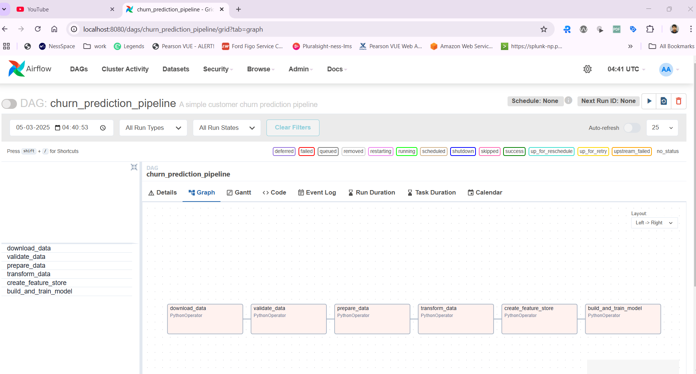
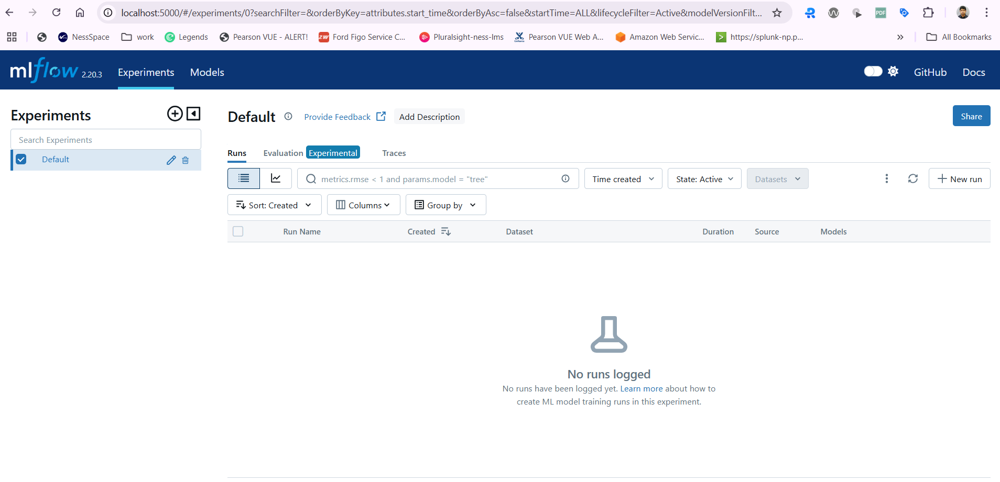

# dmfml-churn-prediction

https://www.kaggle.com/datasets/blastchar/telco-customer-churn?resource=download

https://raw.githubusercontent.com/datasciencedojo/datasets/master/telco-churn-data/telco_churn.csv

https://medium.com/@zulfikarirham02/telco-customer-churn-prediction-using-machine-learning-and-deep-learning-8d1905b04980

https://www.sciencedirect.com/science/article/pii/S2666720723001443

docker build -t customer-churn-airflow:1.0.0 .

docker-compose up airflow-init
docker-compose up

mlflow
http://localhost:5000/#/experiments/0?searchFilter=&orderByKey=attributes.start_time&orderByAsc=false&startTime=ALL&lifecycleFilter=Active&modelVersionFilter=All+Runs&datasetsFilter=W10%3D

airflow
http://localhost:8080/home
airflow/airflow

debuggging
docker exec -it churn-prediction_airflow-webserver_1 bash

clean up
## use pwershell
 docker stop $(docker ps -aq)
 docker rm $(docker ps -aq)
 docker rmi $(docker images -q)
 docker volume prune -f
 docker network prune -f
 docker system prune -a -f